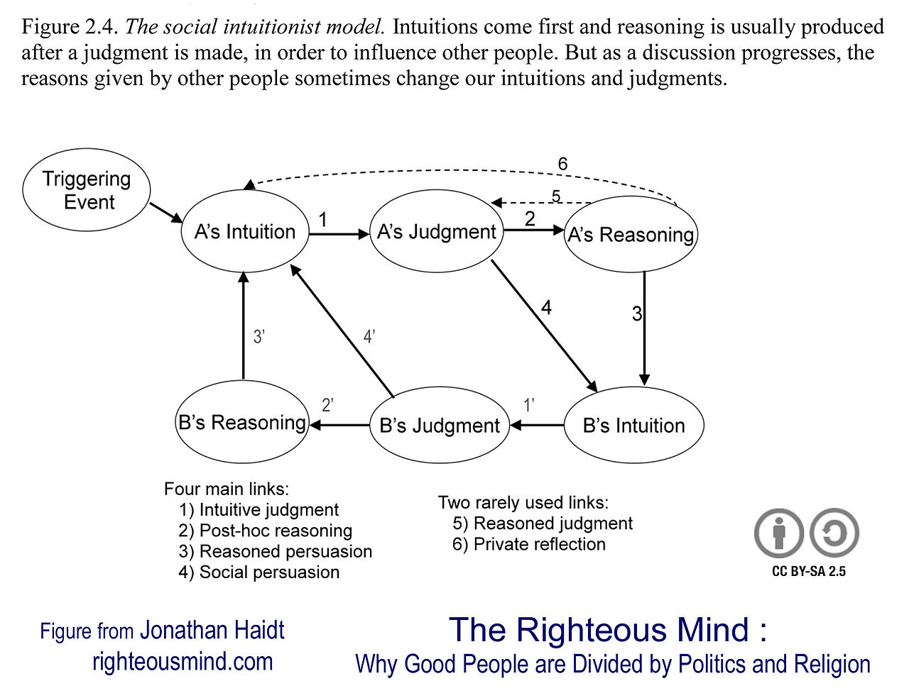

# Prawy umysł

(wszystkie odniesienia są do polskiego wydania z 2014 roku)

> [...] Sąd moralny nie jest jednak zwyczajną subiektywną opinią
> – to stwierdzenie, że ktoś zrobił coś złego.
> Nie mogę domagać się od społeczności, aby Cię ukarała, tylko dlatego,
> że nie podoba mi się to, co robisz. Muszę wskazać coś, co wykracza
> poza moje osobiste preferencje. Właśnie temu służy rozumowanie
> moralne. Zajmujemy się nim nie po to, by odtworzyć rzeczywiste powody,
> z jakich sami dokonaliśmy takiej, a nie innej oceny, lecz po to,
> by znaleźć najlepsze z możliwych powodów, z jakich ktoś inny
> powinien się zgodzić z naszą opinią.
>
> s. 76

Do tej pory myślałem, że tryb uzasadniania i znajdowania tłumaczeń
ma na celu wytłumaczenie się ze swoich działań przed innymi
– krótko mówiąc, obronę. Ustawiając zastososowanie głównie w relacji dziecko-rodzic.

To ma duże implikacje. To oznacza, że osoby które potrafią znaleźć
najlepsze wytłumaczenia, inteligentne osoby z dużą płynnością językową
są w stanie zrównać sobie ludzi i niejako nałożyć presję myślenia
zgodnie z ich systemem moralnym.

## Społeczno-intuicjonistyczny model sądów moralnych

_2001, The Emotional Dog and Its Rational Tail_

Założenia:

- intuicje i reakcje emocjonalne są rodzajem poznania;
- dychotomia emocje - rozumowanie jest błędna;

Model:

Znowu, implikacje są duże. Po pierwsze, mamy tutaj zawartą
pętlę zwrotną (1) → (4) → (1)' → (4)' która generuje wręcz natychmiastowy
pozytywny lub negatywny feedback w zależności od tego, czy dwie osoby 
mają takie same reakcje na zdarzenie. Feedback ten generuje emocje, które
potem potrzebujemy rozwiązać.

Jeśli ich nie ma, korzysta się z (3) i (3)', żeby ustalić wspólną wersję.

Rzadko korzystamy z mechanizmów (5) i (6) – faktycznego rozumowego ustalania
zasad moralnych.

Dodatkowo, wiele innych rzeczy staje się możliwe.

Na podstawie tej pętli zwrotnej następuje propagowanie i ustanawianie się konsensusu
społecznego dotyczacego zachowań godnych i niecnych.

Możemy wykorzystywać ten mechanizm (na poziomie rozumu), żeby też:
- formować grupy
- określać przynależność
- dbać o reputację
- pozyskiwać przychylność osób trzecich

(dwa ostatnie to cytaty z książki).

Od tego miejsca, zasad absolutnych dla całej społeczności wydaje się naturalnym
oszczędzaniem energii, żebyśmy nie musieli w nieskończoność potwierdzać i obalać
swoich sądów moralnych.

# Inne odniesienia

- Patterns, Thinking and Cognition – Margolis
- Błąd Kartezjusza – Damasio (o tym, jak uszkodzenie vmPFC w mózgu skutkuje nieumiejętnością podejmowania decyzji i zniszczeniem intuicji)