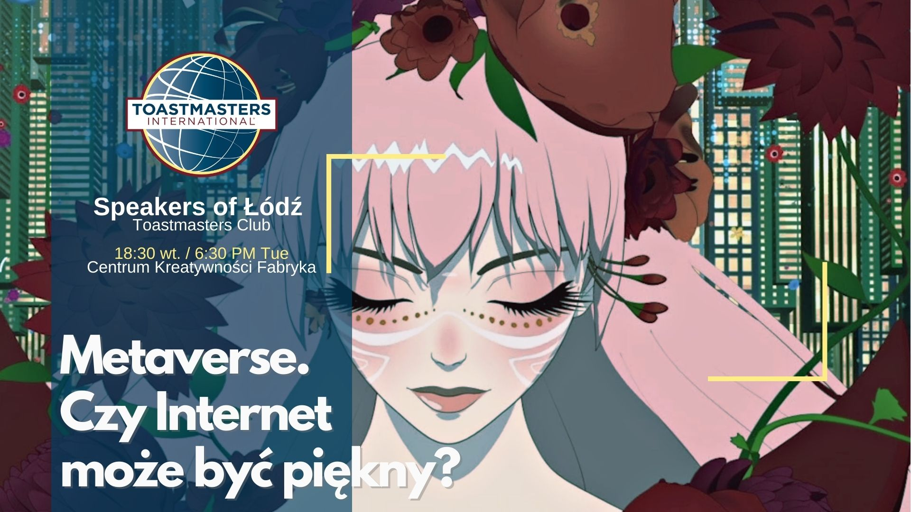
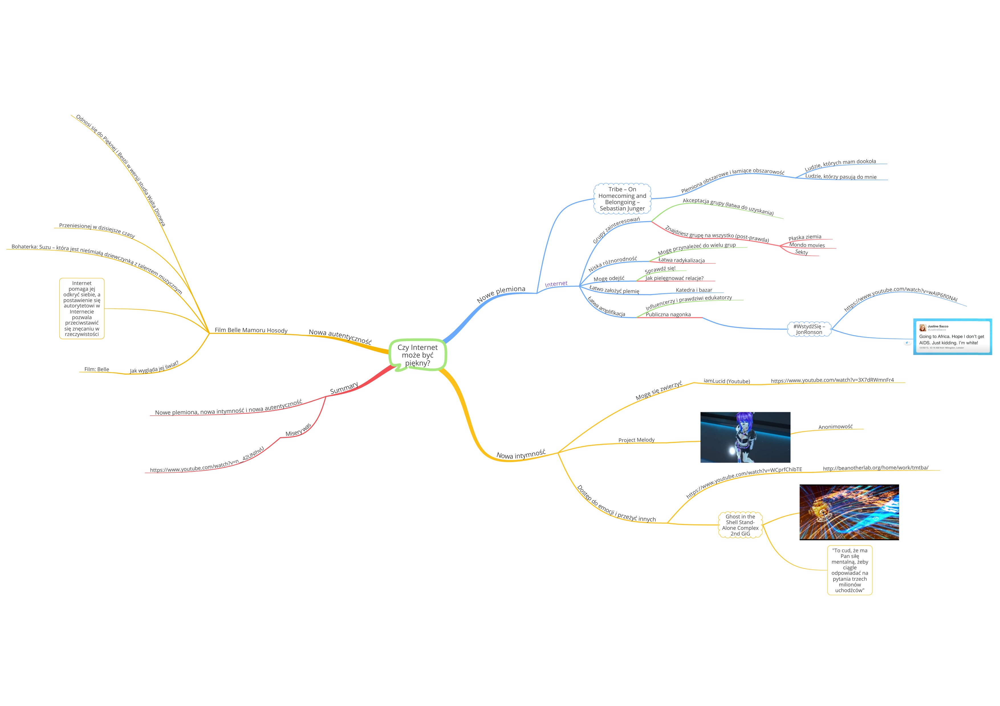

# Metawersum. Czy Internet może być piękny?

# Mapa myśli tematu

# Podsumowanie

- NOWE PLEMIONA: dwa światy czerpią od siebie nawzajem. W świecie rzeczywistym, możemy pielęgnować piękne, długie relacje. W świecie wirtualnym, możemy odkrywać siebie na nowo.
- NOWA INTYMNOŚĆ: gdyby potraktować Internet jako formę teatru, która pozwala nam przeżywać nowe doświadczenia, w której możemy grać siebie, albo kogoś innego, kto nas ciekawi
- NOWA AUTENTYCZNOŚĆ: w symulacji, możemy przeżywać trudne dla nas przeżycia i odgrywać je ze skutkiem terapeutycznym

# Odniesienia i bibliografia

- [Tribe. On Homecoming and Belonging – Sebastian Junger](http://www.sebastianjunger.com/tribe-by-sebastian-junger)
- [So You've Been Publically Shamed – Jon Ronson](https://en.wikipedia.org/wiki/So_You%27ve_Been_Publicly_Shamed) – w polskim wydaniu znana pod tytułem [#WstydźSię](https://lubimyczytac.pl/ksiazka/4443980/wstydzsie)
  - [TED: How One Tweet can ruin your life – Jon Ronson](https://www.youtube.com/watch?v=wAIP6fI0NAI)
- [people in vrchat share their heartbreaks – iamLucid](https://www.youtube.com/watch?v=3X7dRWmnFr4)
- [The Machine to be Another](http://beanotherlab.org/home/work/tmtba/)
  - [krótki wywiad z osobami korzystającymi](https://www.youtube.com/watch?v=WCprfChibTE)
- Influencer udostępniający emocje – _[Ghost in the Shell: Stand-alone complex 2nd GiG](https://ghostintheshell.fandom.com/wiki/Stand_Alone_Complex_2nd_GIG)_: idea uchodźców będacych w ciągłym połączeniu poprzez Internet ze swoim liderem, którego emocjami, wartościami i cnotami się żywią
- [Belle (2021 film)](https://en.wikipedia.org/wiki/Belle_(2021_film))
- [Misery was – exurb1a](https://www.youtube.com/watch?v=n__42UNIhvU)

