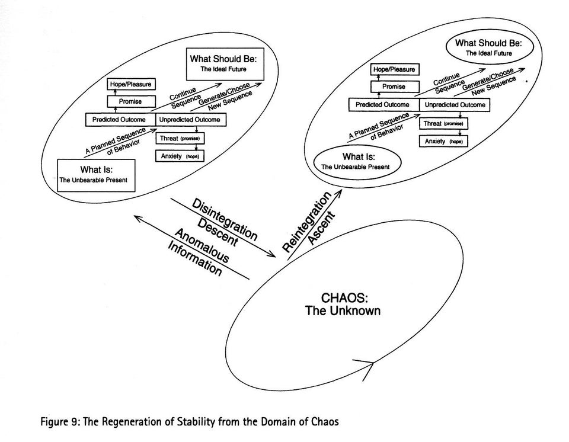

[Prezentacja](https://docs.google.com/presentation/d/10RxbdepIdnGOdAHPGeRYQlgqFpZ9B46VeP7CuCASxlE/edit)

# Sięgaj po inspiracje z różnych źródeł

1. Film
2. Muzyka
3. Gry komputerowe
4. Poezja

# Napięcie

1. Oksymoron
   1. Suchy płacz
   2. Palące zimno
   3. Matczyna zdrada ([toposy](https://pl.wikipedia.org/wiki/Topos)). emocje?
2. Release & Tension (Napięcia i odprężenia)
   1. Adam Neely ft. Little Kruta CLARITY ([utwór](https://www.youtube.com/watch?v=PP66CIzjOS8#t=1m38s), [teoria muzyczna](https://www.youtube.com/watch?v=UKaonmghNfg))
3. Setup & Payoff (Przygotowanie i nagroda)
   1. Konstukcja klamrowa
   2. Strzelba Chechowa [1](https://tvtropes.org/pmwiki/pmwiki.php/Main/ChekhovsGun) [2](https://praktycznymg.pl/strzelba-czechowa.html) (wyjątek: próbujemy komuś zamydlić oczy, patrz kryminał)
   3. Konwencja dowcipu, budowanie krótkie, pointa i zwrot akcji niezwykle szybki
      1. Klamrow
   4. Konwencja horroru (nieuchronność)
      1. Zostawione otwarte drzwi (przez które później wchodzi morderca)
4. Konflikt
   1. Protagonista - antagonista
   2. Protagonista vs fatum / siły przyrody
   3. Konflikt warstw społecznych
   4. Brak konfliktu generuje [power fantasy](https://tvtropes.org/pmwiki/pmwiki.php/Main/PowerFantasy) (fantazję władzy)

Podsumowanie – umiejętne zarządzanie napięciem na różnych poziomach sprawia, że nasze mowy są bardziej czarujące, emocjonujące, jest też podstawą budowania opowieści.

# Dramatic Question / Pytanie dramatyczne

1. Czy Harry Potter pokona wroga, który go osierocił?
2. Czy młoda para się zwiąże ze sobą pomimo przeciwności losu? Romeo i Julia
3. Czy Shrek wreszcie zazna spokoju?
2. Co, gdybyśmy mogli cofać się w czasie? Uwaga – ta nowa rzecz musi dać nam jakieś nowe możliwości. (what, if... – science fiction)
   3. Kontrprzykład – co jakby banan smakował jak kurczak?
4. Co powstrzymuje bohatera przed osiągnięciem tego celu?
   1. Z jednego powstrzymania powinno wynikać inne
   2. Presja czasu wynika z dobrego powiązania elementów, konsekwencje
      1. Przykład (horror): Zamykamy się od środka, a potem wyskakujemy przez okno z pierwszego piętra. Nie możemy już wrócić do budynku.

Podsumowanie – opanowanie Dramatic Question pozwala na budowanie napięcia poprzez akcję popychającą bohatera do przodu.

[The Dramatic Question and Suspense in Fiction](https://thewritepractice.com/the-dramatic-question-and-suspense-in-fiction/)

# Rekontekstualizacja

1. Tekst piosenki [Karnivool – We are](https://www.youtube.com/watch?v=2q0hQaoHStE)
2. Nietzsche i afirmacja życia. Homage: [Cyberpunk 2077 clip](https://www.youtube.com/clip/Ugkx60C_rmr-NhldFkcgvb1lIhUepqlcOw6k). [Dokładniejsze wytłumaczenie](../piekno.md).
3. Dojrzewanie / rozwój / zmiana – czyja?
   1. W opowieści - bohatera (przemiana bohatera)
   2. W mowie perswazyjnej, informacyjnej – publika
   2. W mowie okolicznościowej - nic się nie zmienia.

Podsumowanie – opanowanie rekontekstualizacji pozwala zaskakiwać, przedstawiać rzeczy w nowym świetle i zapewnia wewnętrzny wzrost bohaterom opowieści

# Podstawowa opowieść

1. Jordan Peterson – [Maps of Meaning](https://en.wikipedia.org/wiki/Maps_of_Meaning) - Mapy sensu
   1. Diagram powyżej
   2. Przykład – utrata bliskiej osoby
      1. Nasze wcześniejsze postrzeganie świata i naszego w nim miejsca
      2. Dezintegracja – nagle tracimy grunt pod nogami i wpadamy w chaos w którym nie wiemy gdzie jesteśmy, w jakim kierunku się poruszać i dokąd dojdziemy
      3. Z czasem – reintegracja naszego miejsca w świecie i postrzegania świata, rekontekstualizuje dotychczasowe przeżycia w nowym, poszerzonym jego zrozumieniu
2. Co Cię nie zabije, to Cię wzmocni – też Nietzsche
3. Monomit / Opowieść bohatera - to syntetyczna forma opisu przeżyć, które nas formują
   1. Napięcie: wynika z zaskoczenia, zanurzania się w chaosie, mierzenia się z trudnościami
   2. Dramatyczne pytanie i przeszkody: praca, którą wykonujemy
   3. Rekontekstualizacja: pozwala na wzrost z zachowaniem dotychczasowej tożsamości

# Warto się zaznajomić też z...

1. Unreliable Narrator / Nierzetelny narrator
   1. Kryminały 
   2. Morrowind – wierzalna religia
2. Layering techniques / Używanie warstw
   1. Dobra bajka / opowieść odkrywa coś nowego co 10 lat. Nie pomija dzieci, nie nudzi dorosłych
3. ... (more to follow in the future)